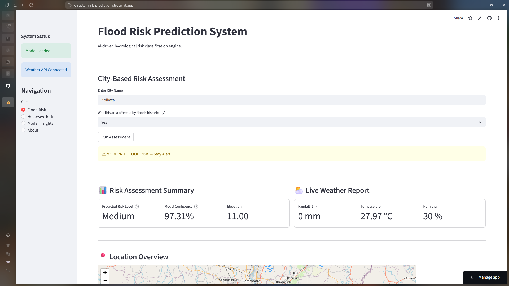
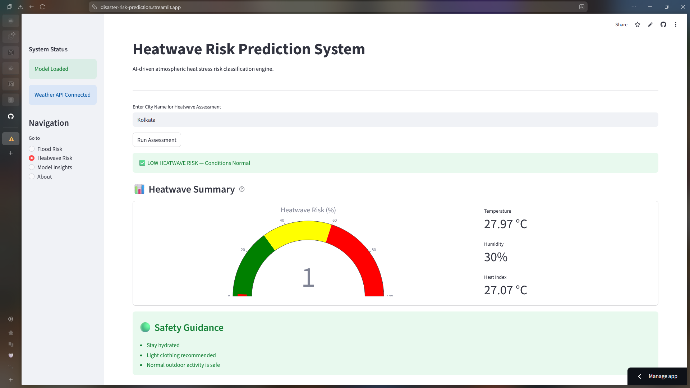
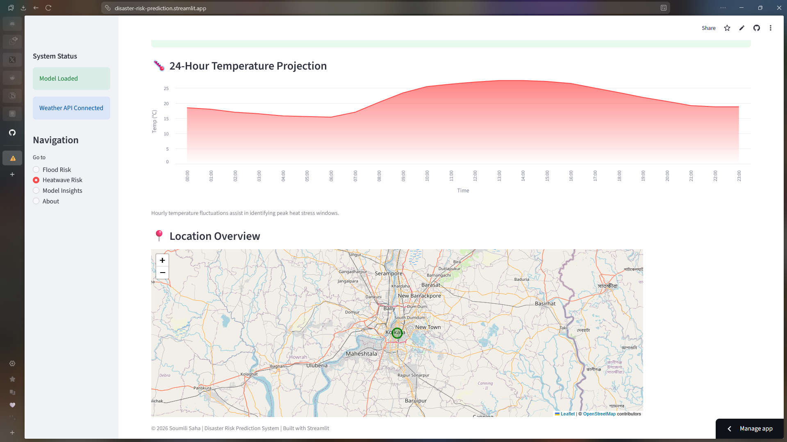

# ⚠️ Multi-Hazard Disaster Risk Prediction System

A real-time, end-to-end machine learning system for assessing flood and heatwave risks using live meteorological data and advanced classification models.

This platform integrates weather APIs, feature engineering pipelines, and trained ML models into a deployable Streamlit dashboard for actionable disaster risk assessment.

---

## 📌 Problem Statement

Floods and heatwaves are among the most recurring and destructive climate hazards, especially in rapidly urbanizing and climate-sensitive regions. The increasing frequency of extreme weather events demands scalable, data-driven early warning systems.

Traditional forecasting models are often domain-specific and not easily accessible to the public. This project addresses that gap by building a modular, machine learning-based system capable of real-time, multi-hazard risk classification using live environmental indicators.

---

## 📁 Project Structure

```
Disaster_Risk_Prediction/
├── app.py                              
├── requirements.txt                       
├── README.md                             
├── data/
│   ├── flood_dataset.csv                 
│   └── heatwave_dataset.csv              
├── models/
│   ├── flood_risk_model.pkl             
│   └── heatwave_model.pkl                
└── notebooks/
    ├── flood_model_training.ipynb        
    └── heatwave_model_training.ipynb 
```

---

## 🧠 Methodology

### 🌊 Flood Risk Module

- Hydrological indicators processed and stratified into training and testing sets.
- Risk categories (Low / Moderate / High) derived using clustering techniques.
- XGBoost multi-class classifier trained on structured tabular features.
- Cross-validation applied for robust generalization.
- Feature importance analyzed for interpretability and risk driver identification.

---

### 🔥 Heatwave Risk Module

- Binary heat stress classification based on meteorological indicators.
- Stratified train-test split to address class imbalance.
- Random Forest classifier selected based on macro F1 and ROC-AUC performance.
- Feature importance analysis conducted to interpret atmospheric risk drivers.

---

## 📊 Model Performance

### Flood Risk Classifier (XGBoost)

| Metric | Value |
|--------|-------|
| Test Accuracy | **98.85%** |
| Macro F1 Score | **98.49%** |
| Macro Recall | **98.49%** |

**Key Insights:**
- Strong generalization across stratified test split
- Excellent performance on all three risk classes
- Top features: Historical Flood Presence, Water Level, River Discharge

### Heatwave Risk Classifier (Random Forest)

| Metric | Value |
|--------|-------|
| Test Accuracy | **96.61%** |
| F1 Score | **91.02%** |
| ROC-AUC | **99.23%** |

**Key Insights:**
- Robust prediction of heat stress conditions
- Balanced precision and recall for early warning capabilities
- Top features: Temperature anomalies, Humidity, Wind Patterns

---

## 💻 Deployment Architecture

The system is deployed using **Streamlit** with a multi-page interface including:

### Pages

1. **Flood Risk Assessment**
   - City-based flood risk prediction
   - Real-time weather data integration
   - Risk probability visualization
   - Geospatial mapping with folium
   - Hydrological indicators dashboard

   

2. **Heatwave Risk Assessment**
   - Atmospheric heat stress prediction
   - Comprehensive weather analytics
   - Heatwave probability metrics
   - Location-based risk visualization
   - Warning system indicators

   
   

3. **Model Insights**
   - Flood model architecture and methodology
   - Heatwave model approach and rationale
   - Feature importance explanations
   - Validation strategy documentation
   - Algorithm selection justification

4. **About**
   - Project overview
   - ML concepts applied
   - System architecture
   - Development methodology

The application performs real-time API data ingestion, feature engineering, model inference, and interactive visualization within a unified modular architecture.

---

## 🛠 Technology Stack

**Core Machine Learning:**
- Scikit-learn (preprocessing, Random Forest)
- XGBoost (gradient boosting classifier)

**Data Processing:**
- Pandas (data manipulation)
- NumPy (numerical computing)

**Visualization:**
- Matplotlib (statistical plots)
- Folium (geospatial mapping)

**Deployment & APIs:**
- Streamlit (web interface)
- OpenWeather API
- Open-Meteo API

**Additional Tools:**
- Joblib (model serialization)
- Python 3.10+

---

## 🚀 How to Run Locally

### Prerequisites
- Python 3.8 or higher
- Git installed on your system
- Internet connection for API calls

### Installation Steps

1. **Clone the repository**
   ```bash
   git clone https://github.com/logitechsoumili/Disaster_Risk_Prediction.git
   cd Disaster_Risk_Prediction
   ```

2. **Install dependencies**
   ```bash
   pip install -r requirements.txt
   ```

3. **Get OpenWeather API Key**
   - Sign up at [OpenWeather](https://openweathermap.org/api)
   - Copy your API key

4. **Configure Streamlit Secrets**
   - Create `.streamlit/secrets.toml` in the project root:
   ```bash
   mkdir .streamlit
   ```
   - Add your API key to `.streamlit/secrets.toml`:
   ```toml
   OPENWEATHER_API_KEY = "your_api_key_here"
   ```

5. **Run the application**
   ```bash
   streamlit run app.py
   ```

The app will open in your default browser at `http://localhost:8501`

---

## 📈 Future Enhancements

- Multi-hazard expansion (Cyclone, Earthquake, Drought modules)
- Integration with real-world meteorological datasets (IMD, NOAA)
- Mobile application for on-the-go risk assessment
- Time-series forecasting with LSTM/Prophet
- Push notifications for high-risk alerts
- Database integration for historical data storage
- Multi-language support for regional deployment